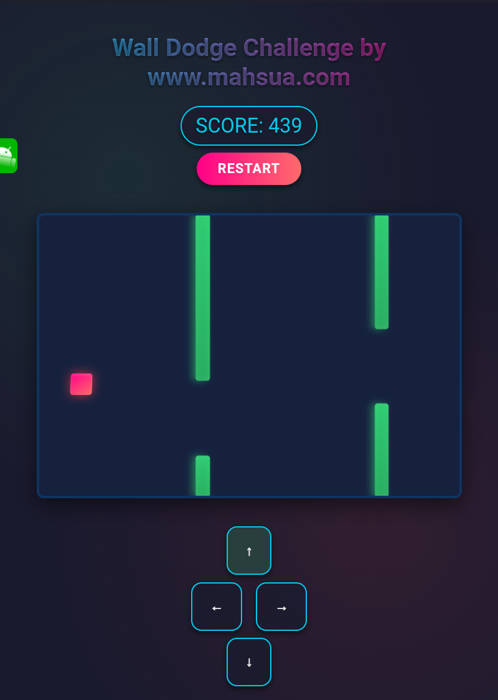

# Wall Dodge Challenge 🎮


[](https://mahsuait.github.io/Wall-Dodge-Challenge-/)


 <!-- Add your screenshot here -->

A thrilling 3D-style dodging game where you navigate a red square through moving green walls. Test your reflexes and see how long you can survive!

## Features ✨

- 🕹️ **Intuitive Controls**: Long-press buttons for continuous movement
- 🏗️ **Dynamic Difficulty**: Walls move faster as you progress
- 🎯 **Precise Collision Detection**: Pixel-perfect hit detection
- 📊 **Score Tracking**: Compete against your high score
- 🌈 **3D Visual Effects**: Immersive pseudo-3D perspective
- 📱 **Responsive Design**: Works on desktop and mobile devices

## How to Play 🕹️

1. Use the **arrow buttons** (or long-press for continuous movement)
2. Navigate the **red square** through gaps in the green walls
3. Survive as long as possible to increase your score
4. Avoid colliding with the walls!

## Controls 🎛️

| Button | Action       |
|--------|-------------|
| ↑      | Move Up     |
| ↓      | Move Down   |
| ←      | Move Left   |
| →      | Move Right  |
| Restart| Reset Game  |

## Installation 💻

No installation required! Just open `index.html` in your browser.

```bash
# Or run a local server (optional)
python3 -m http.server 8000
