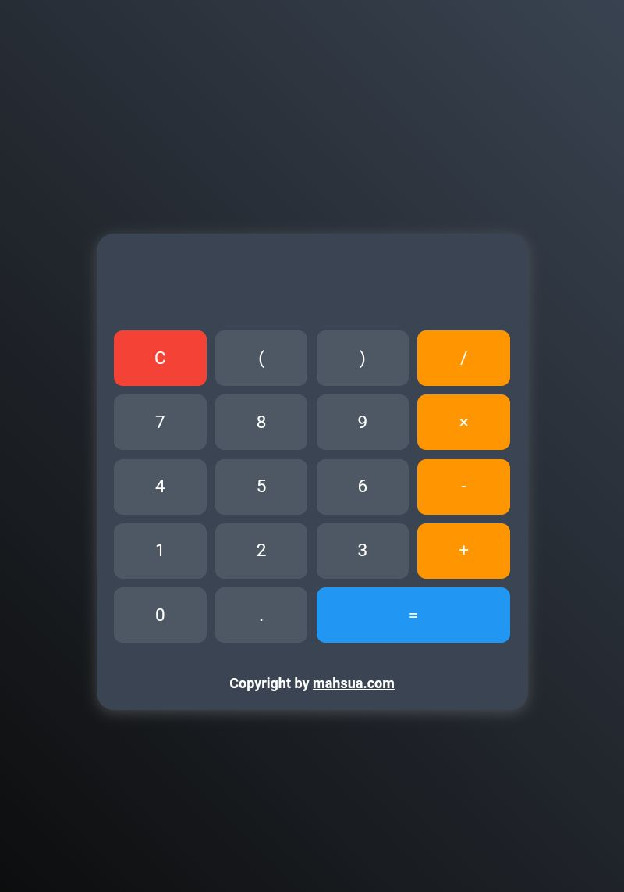

# Modern Calculator 🧮

A sleek and responsive web calculator with modern UI design, smooth animations, and keyboard support. Perfect for basic arithmetic operations with style!

[](https://mahsuait.github.io/Modern-Calculator/)


 <!-- Add your screenshot here -->

## Features ✨

- **Modern UI Design**
  - Gradient background
  - Glassmorphism effect
  - Smooth hover animations
  - Responsive layout
- **Full Keyboard Support**
- **Error Handling**
- **Advanced Operations**
  - Parentheses support
  - Decimal point calculations
- **Color-coded Buttons**
  - Different colors for operators
  - Clear button with red accent
  - Equals button with blue highlight
- **Cross-platform Compatibility**

## Installation & Usage 🚀

### Quick Start
1. Clone the repository:
   ```bash
   git clone https://github.com/mahsuait/Modern-Calculator.git